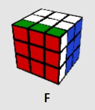
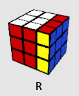
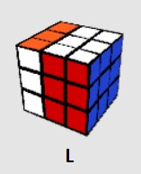
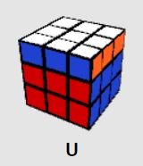
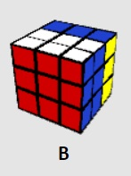

## Colors in Bytes

| C | B | A | Color   | DEC Number   |  Color thread |
|---|---|---|---------|:------------:|---------------|
| 0 | 0 | 1 | Blue    | 1            | Orange        | 
| 0 | 1 | 0 | Green   | 2            | Grey          |
| 0 | 1 | 1 | Cyan    | 3            | Black         |
| 1 | 0 | 0 | Red     | 4            | Yellow        |
| 1 | 0 | 1 | Purple  | 5            | Purple        |
| 1 | 1 | 0 | Yellow  | 6            | White         |

## Rubik's Cube Moves

| Letter   | Move           | Picture                          | Number Library     | Keyboard |
|:--------:|:---------------|----------------------------------|:------------------:|:--------:|
| F        | Front          |  | 8                  | F        |
| F'       | Front inverse  | | 9                  | f        |
| R        | Right          |  | 2                  | R        |
| R'       | Right inverse  | | 3                  | r        |
| L        | Left           |  | 1                  | L        |
| L'       | Left inverse   | | 0                  | l        | 
| U        | Up             |  | 7                  | U        |
| U'       | Up inverse     | | 6                  | u        | 
| D        | Down           |  | 4                  | D        | 
| D'       | Down inverse   | | 5                  | d        | 
| B        | Back           |  | 10                 | B        | 
| B'       | Back inverse   | | 11                 | b        | 

## Rubik's Cube State

```c++
      2 2 2                               5 2 2 
      2 2 2                               5 2 2 
      2 2 2                               5 2 2 
4 4 4 5 5 5 3 3 3 6 6 6             4 4 4 1 5 5 3 3 3 6 6 2 
4 4 4 5 5 5 3 3 3 6 6 6             4 4 4 1 5 5 3 3 3 6 6 2 
4 4 4 5 5 5 3 3 3 6 6 6             4 4 4 1 5 5 3 3 3 6 6 2 
      1 1 1                               6 1 1
      1 1 1                               6 1 1                                           
      1 1 1                               6 1 1
```


